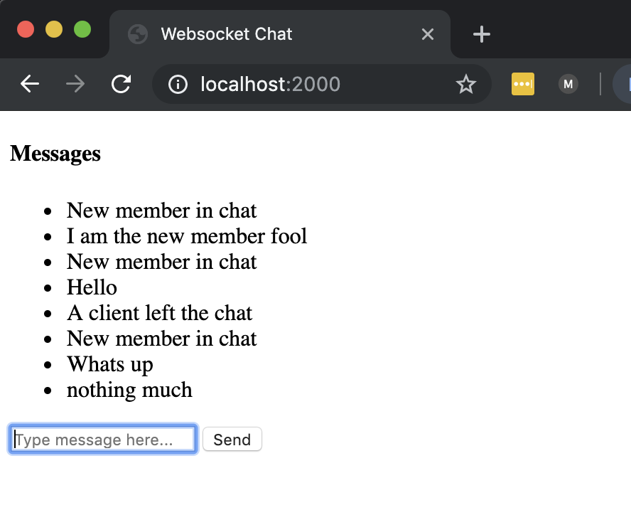

# Overview
This repo uses Websockets to spawn a simple global chat server. Uses 'ws' npm module

###
see [Websockets 101 Guide in Gitbook](https://furkhan324.gitbook.io/workspace/dev/web/websockets-101)

## Usage
    $ node server.js
    # Navigate to localhost:2000
